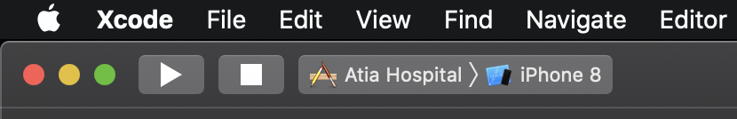

# Atia Consulting Hospital Demo App


> Quick demo project for booking the appointment for hospital as well as admin panel

[![Swift Version][swift-image]][swift-url]
[![License][license-image]][license-url]
[](https://github.com/Carthage/Carthage)
[](https://img.shields.io/cocoapods/v/LFAlertController.svg)  
[](http://cocoapods.org/pods/LFAlertController)

The project represents native iOS application for iPhone and iPad user interface, written in Swift Programming Language. Since the app contains user authentication and validation as well as sync between the devices, some sort of backend and realtime database is used - [Firebase](https://firebase.google.com). 


## Features

- [x] User Login and Authentication

- [x] Creating new user / Signup

- [x] Logout

- [x] Booking the appointment and seeing the list of approved ones

- [x] Administration dashboard to approve/decline the appointment

  

## Technical Specification

| Programming Language                       | Swift, version 5                                             |
| ------------------------------------------ | ------------------------------------------------------------ |
| Dependency manager for 3rd party libraries | [CocoaPods](http://cocoapods.org/)                           |
| User Interface                             | Storyboards with Autolayout Constraints                      |
| Architecture                               | [Three layer clean architecture](https://blog.cleancoder.com/uncle-bob/2012/08/13/the-clean-architecture.html): Business, Data access and Presentation Layers. |
| Design Pattern                             | Mode-View-ViewModel with Routing [MVVM+R](https://www.slideshare.net/yltastep/mvvmrouter-with-swift) |
| Concepts Used                              | Dependency Injection, Data Binding                           |
| Dependencies on 3rd party libraries        | 'Firebase/Core', 'Firebase/Database', 'Firebase/Auth', 'SwiftMessages' |
| Configurations/BuildVariants/Flavours      | The project has three configurations: develop, release and staging. By chaning any of the them the bundle id, version number and other preferences are changed on compile time |
| Code Style                                 | [Swiftlint](https://github.com/realm/SwiftLint)              |
| Pre Build Shell Scripts                    | [Swiftgen](https://github.com/SwiftGen/SwiftGen) - generates the code from image asset catalogue and storyboard files |


## Requirements

- iOS 13.x.x +
- Xcode 11.x.x +
- Mac OS X 10.15.x + (Catalina)

## Installation and Project Setup

In order to run the project you will need following:

* Mac machine with OS X 10.15.x
* XCode 11 IDE for iOS, could be downloaded [here](https://apps.apple.com/us/app/xcode/id497799835?ls=1&mt=12)

#### Github

Clone the project

`git clone https://github.com/ModernMantra/atia-hospital`

#### Xcode

After the third party libraries are downloaded and linked with project, open the file `Atia Hospital.xcworkspace` with `Xcode`. Chose the device from menu and hit run.
* In case you could not build the project for some reason due to linked 3rd party libraries, jump to Section Cocoapods, after completing it, open and run the project again



#### CocoaPods

Install [CocoaPods](http://cocoapods.org/) dependency manager by running in your CLI :

```ruby
$ sudo gem install cocoapods
```

Navigate to the root file of the cloned project and run command below  in the CLI, which will download the project 3rd party libraries and link with it.

``` swift
$ pod install
```

NOTE:

In order to login as administrator to see dashboard, login with `admin@atia.ba`, password `123456`

In order to book the appointment, feel free to create yourself the user in Signup section of the app.


------


## Meta

Kerim Njuhovic – kerimnjuhovic@gmail.com

Distributed under the MIT license. See ``LICENSE`` for more information.

[swift-image]:https://img.shields.io/badge/swift-5.0-orange.svg
[swift-url]: https://swift.org/
[license-image]: https://img.shields.io/badge/License-MIT-blue.svg
[license-url]: LICENSE
[travis-url]: https://travis-ci.org/dbader/node-datadog-metrics
